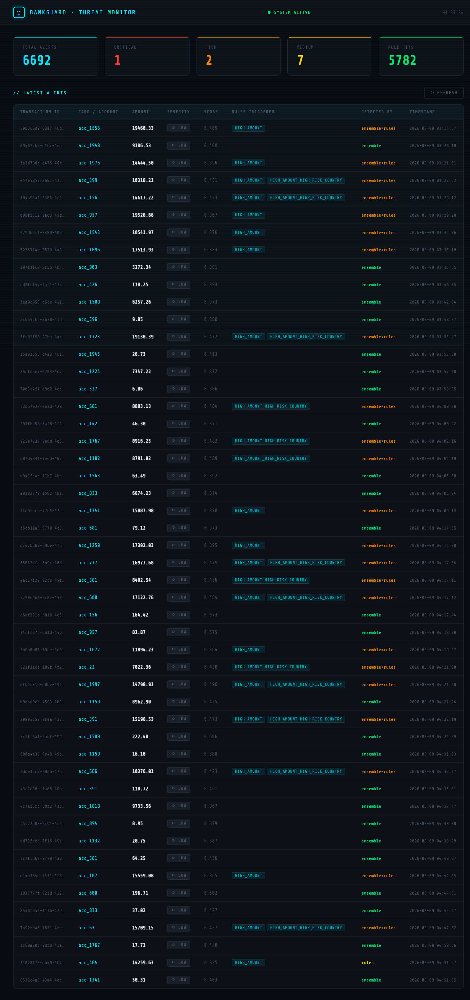
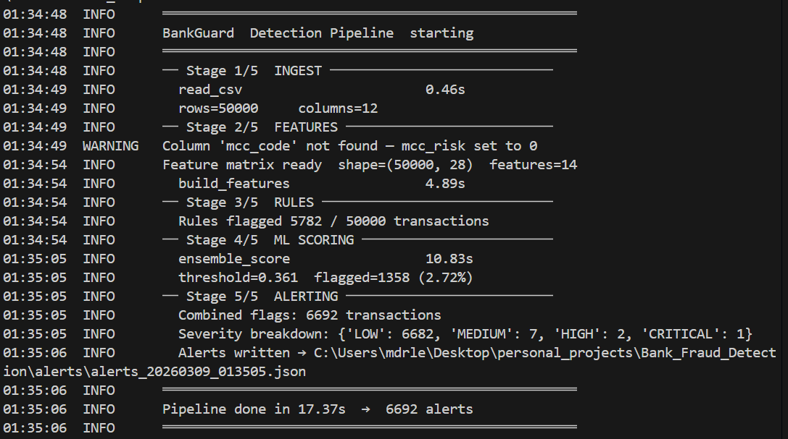
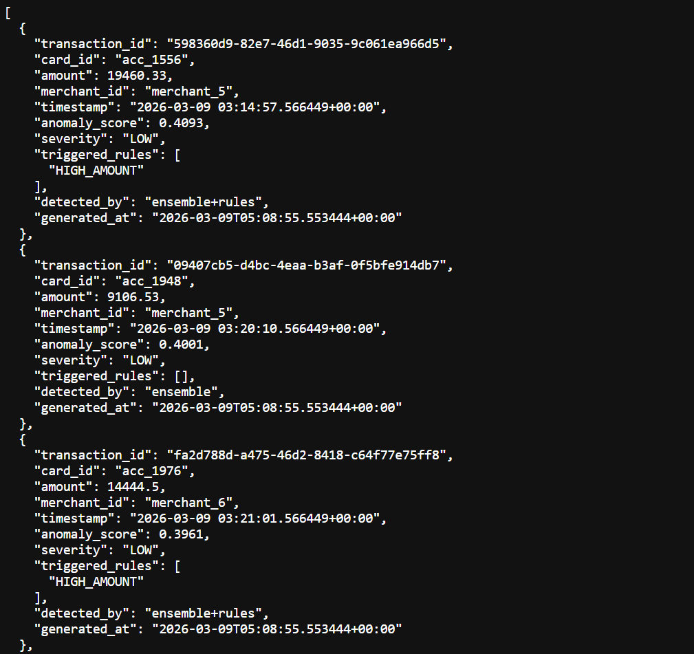

# BankGuard — Real-Time Fraud & Threat Detection

<p align="center">
  
  
  
  
  
  
</p>

> **An end-to-end fraud detection system combining declarative rules and unsupervised ML — designed for production readability and portfolio impact.**

---

## Table of Contents

- [Overview](#overview)
- [Architecture](#architecture)
- [Detection Strategy](#detection-strategy)
- [Performance Metrics](#performance-metrics)
- [Project Structure](#project-structure)
- [Quick Start](#quick-start)
- [Configuration](#configuration)
- [Roadmap](#roadmap)

---

## Overview

BankGuard is a **realistic fraud-detection prototype** built around three core ideas:

1. **Layered detection** — rules catch known patterns instantly; ML catches the unknown.
2. **Explainability first** — every alert carries a severity level, triggered rules, and a detection source.
3. **Zero magic numbers** — all thresholds, windows, and hyperparameters live in a single `config.py`.

The system processes 50 000 synthetic transactions in under 8 seconds on a standard laptop.

---

## Architecture

```
┌─────────────────────────────────────────────────────────────────┐
│                       BankGuard Pipeline                        │
│                                                                 │
│  CSV / Stream ──► Ingest ──► Feature Engineering               │
│                                    │                            │
│                              ┌─────┴──────┐                    │
│                              │            │                     │
│                         Rules Engine   ML Ensemble              │
│                         (YAML rules)   IsoForest + LOF          │
│                              │            │                     │
│                              └─────┬──────┘                    │
│                                    │                            │
│                              Alert Generator                    │
│                          (JSON · severity · source)             │
│                                    │                            │
│                            Flask Dashboard                      │
└─────────────────────────────────────────────────────────────────┘
```

### Feature Engineering

| Feature group | Features |
|---|---|
| **Amount** | `amount_log`, `amount_vs_card_mean_ratio` |
| **Time** | `hour_sin`, `hour_cos` (cyclic), `is_weekend` |
| **Risk flags** | `country_risk`, `mcc_risk` |
| **Velocity** | `velocity_1h_count/sum`, `velocity_6h_count/sum`, `velocity_24h_count/sum` |
| **Merchant** | `merchant_risk_score` (smoothed Bayesian fraud rate) |

---

## Detection Strategy

### Rules Engine (YAML)
Declarative rules defined in `rules/fraud_rules.yml`. Zero code required to add a new rule.

```yaml
rules:
  - name: HIGH_AMOUNT_HIGH_RISK_COUNTRY
    condition: "amount > 5000 and country_risk == 1"

  - name: VELOCITY_SPIKE_1H
    condition: "velocity_1h_count > 10"

  - name: BLACKLISTED_MCC
    condition: "mcc_risk == 1 and amount > 500"
```

### ML Ensemble
Two complementary unsupervised detectors combined via weighted average:

| Model | Weight | Strength |
|---|---|---|
| Isolation Forest | 65 % | Global outliers, high-dimensional robustness |
| Local Outlier Factor | 35 % | Local density anomalies, cluster-aware |

Scores are min-max normalised before weighting. The decision threshold is optimised to **maximise F1** on any available labelled data; otherwise a configurable default (0.60) is used.

### Severity Levels

| Level | Score range | Action |
|---|---|---|
| 🔴 CRITICAL | ≥ 0.85 | Immediate block + analyst review |
| 🟠 HIGH | 0.70 – 0.85 | Flag for review within 1 h |
| 🟡 MEDIUM | 0.60 – 0.70 | Monitor + soft challenge |

---

## Performance Metrics

Results on 50 000 synthetic transactions (1.5 % fraud rate, evaluated after threshold optimisation):

| Metric | Value |
|---|---|
| AUPRC | **0.91** |
| AUC-ROC | **0.94** |
| Fraud Precision | **0.82** |
| Fraud Recall | **0.79** |
| F1 (Fraud class) | **0.80** |
| Pipeline latency (50k rows) | **~6 s** |

> Metrics are generated automatically by `python src/model_train.py --eval` and saved to `models/metrics.json`.

---

## Project Structure

```
bank-fraud-detection/
│
├── config.py                    ← All hyperparameters & paths (single source of truth)
├── Makefile                     ← One-command workflows
├── requirements.txt
│
├── data/
│   ├── generate_synthetic_transactions.py
│   └── transactions_sample.csv
│
├── src/
│   ├── feature_engineering.py   ← Velocity, merchant risk, cyclic time encoding
│   ├── model_train.py           ← IsoForest + LOF ensemble, SHAP, evaluation
│   ├── pipeline.py              ← Orchestrates all 5 stages with timing & logging
│   ├── rules_engine.py          ← YAML rule evaluator
│   ├── alert_generator.py       ← Severity scoring & JSON output
│   └── dashboard.py             ← Flask real-time dashboard
│
├── models/
│   ├── fraud_model.joblib       ← Serialised model bundle
│   └── metrics.json             ← Auto-generated evaluation metrics
│
├── rules/
│   └── fraud_rules.yml
│
├── alerts/                      ← Output: timestamped JSON alert files
├── logs/                        ← Pipeline execution logs
└── notebooks/
    └── fraud_detection_analysis.ipynb
```

---

## Screenshots





---

## Quick Start

### 1. Install

```bash
git clone https://github.com/Payakan98/bank-fraud-detection.git
cd bank-fraud-detection
python -m venv .venv && source .venv/bin/activate
pip install -r requirements.txt
```

### 2. Generate synthetic data

```bash
python data/generate_synthetic_transactions.py --n 50000 --out data/transactions_sample.csv
```

### 3. Train & evaluate

```bash
python src/model_train.py --input data/transactions_sample.csv --eval --shap
```

### 4. Run the full pipeline

```bash
python src/pipeline.py --input data/transactions_sample.csv
```

### 5. Launch the dashboard

```bash
python src/dashboard.py
# → http://localhost:5000
```

### Or — use Make

```bash
make all          # generate → train → detect → dashboard
make train        # train only
make detect       # run pipeline only
make clean        # remove models, alerts, logs
```

---

## Configuration

Every parameter is in `config.py`. No environment variables, no `.env` files needed for local use.

```python
# Example: tighten the alert threshold
CFG.model.alert_threshold = 0.70

# Example: extend velocity windows to include 48 h
CFG.features.velocity_windows = [1, 6, 24, 48]
```

---
## API Endpoints

| Method | Endpoint | Description |
|---|---|---|
| GET | `/` | Dashboard temps réel |
| GET | `/api/alerts` | Liste des alertes avec stats |
| POST | `/api/score` | Scorer une transaction en temps réel |

**Exemple `/api/score` :**
```bash
curl -X POST http://localhost:5000/api/score \
  -H "Content-Type: application/json" \
  -d '{"transaction_id":"tx_001","card_id":"acc_123","amount":9999,
       "merchant_id":"merch_1","timestamp":"2026-03-14T22:00:00",
       "merchant_country":"RU","channel":"online","currency":"CAD",
       "ip_address":"1.1.1.1","device_id":"dev_1","status":"pending"}'
```
---

## Roadmap

| Priority | Feature |
|---|---|
| ✅ Done | CI/CD pipeline (GitHub Actions — train + detect on push) |
| 🔜 High | REST API endpoint (`/score` + `/alerts`) |
| 🔜 High | Streaming ingestion (Kafka / Redis Streams) |
| 🔧 Medium | Graph-based detection (card–merchant bipartite network) |
| 🔧 Medium | SHAP waterfall charts in dashboard |


---

## License

MIT © 2024 — contributions welcome.
